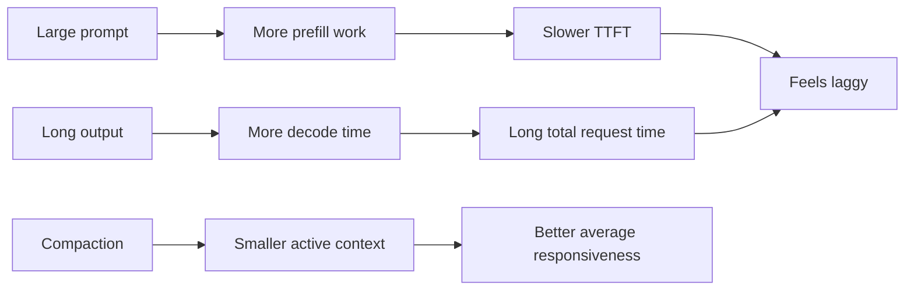
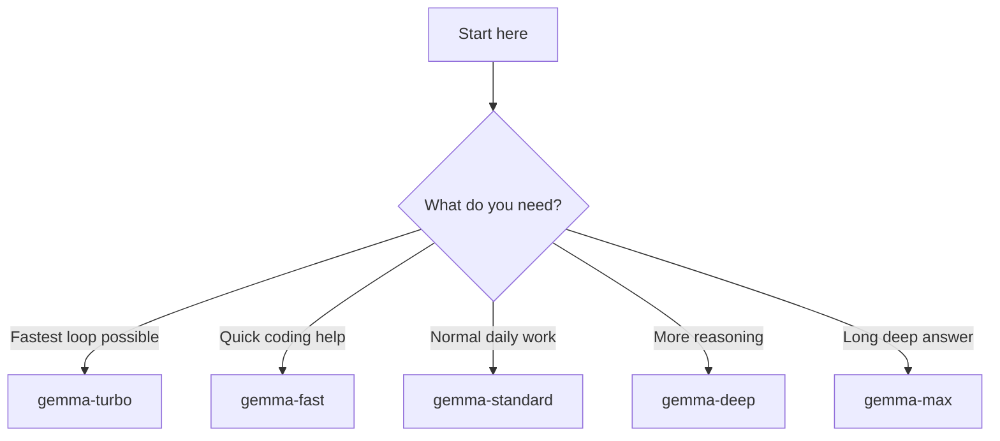
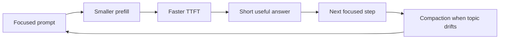

# 🙂 Kronk Tuning Guide

This guide is the friendly version of what the logs taught us:

- **big prompts slow Kronk down**
- **long outputs slow Kronk down**
- **compaction is your friend**
- **32K speed presets (`gemma-turbo` / `gemma-fast`) are the fastest baseline; standard and depth presets run at 64K**

On this Mac, the fastest improvement usually comes from **changing how the prompt is built**, not from blindly increasing context.

---

## 🚀 Quick answer

If you want the short version:

1. use **`gemma-standard`** as the daily default
2. switch to **`gemma-fast`** or **`gemma-turbo`** when the loop feels sluggish
3. switch to **`gemma-deep`** or **`gemma-max`** only when you truly need more reasoning or longer answers
4. keep prompts focused and outputs shorter whenever possible
5. let OpenCode compact the session instead of preserving huge raw history forever

---

## 🧠 Why the system gets slow

The repo's log analysis already showed the real bottlenecks:

- older sessions with **28K-35K prompt tokens** were hitting very slow TTFT
- after improving the runtime shape, **very long outputs** became the next slowdown
- the main pain was usually **prefill + cache rebuild**, not model crashes

External Apple Silicon and llama.cpp guidance points in the same direction:

- local inference is heavily **memory-bandwidth bound**
- larger context windows raise the cost of active prompt state
- trimming prompt size and output size is often worth more than adding more raw context

### Mermaid view



---

## 🔎 What the logs told us

### Before

The older daily shape was more permissive:

- **64K**
- `nseq-max: 2`
- thinking on

That worked, but large coding sessions started paying a big tax:

- **28K-35K prompt tokens** could push TTFT into tens of seconds
- some requests drifted into **1m+** total latency
- the model was spending too much time rebuilding or extending big prompt state

### After

The faster shapes improved the situation:

- lower sequence pressure
- less reasoning overhead in the faster presets
- shorter outputs in the faster presets

That moved the main pain from **catastrophic prefill** to **overly long answers**.

### Real takeaway

**Speed is mostly about keeping the active job small and focused.**

That means:

- smaller prompt
- smaller output
- earlier compaction
- tighter preset for routine work

---

## ✂️ Prompt hygiene = performance tuning

This is the most important part of the guide.

If the session feels slow, look here **before** touching context size.

### ✅ Do this

- ask for one concrete task at a time
- include only the files or snippets that matter
- ask for short answers first, then deepen if needed
- branch or compact when the topic drifts
- reuse the same session while the task is still tightly related

### ❌ Avoid this

- pasting entire large files when you only need one function
- asking for a huge review plus implementation plus architecture advice in one turn
- requesting exhaustive answers by default
- dragging along stale instructions that no longer matter
- letting the session grow just because the context window allows it

### Better prompt patterns

| Slow pattern | Faster pattern |
|---|---|
| "Review this whole module and explain everything." | "Review this function for the null-path bug and keep the answer brief." |
| "Use all these files for context." | "Use only these two files unless you find a hard dependency." |
| "Give me the complete final solution and every tradeoff." | "First give me the best fix and the main tradeoff." |
| "Keep all prior discussion in mind." | "Use the current summary and focus only on this next step." |

---

## 🎛️ Recommended Gemma preset ladder

These presets are now about **speed vs depth**, not about chasing the biggest raw context.

All Gemma presets below use:

- **32K on `gemma-turbo` / `gemma-fast`**
- **64K on `gemma-standard` / `gemma-deep` / `gemma-max`**
- **`nseq-max: 2`**
- `q4_0` KV cache
- flash attention enabled

> **Note:** `nseq-max: 1` was briefly used but caused `context canceled` errors on concurrent requests from OpenCode (second slot had no room while a long prefill was in progress). All presets are back to `nseq-max: 2`.

### 🏷️ Preset naming convention

Preset names are now split into **two families**:

- **speed family** = lighter, faster, shorter-output presets
- **depth family** = more reasoning and longer-output presets

Naming rule:

- **speed presets** use `gemma-<speed-label>`
- **depth presets** use `gemma-<depth-label>`

### ⚡ Speed presets

| Preset | Context | Thinking | `max_tokens` | Best for |
|---|---:|---|---:|---|
| `gemma-turbo` | 32K | off | 512 | ultra-fast iteration |
| `gemma-fast` | 32K | off | 1024 | quick coding help |
| `gemma-standard` | 64K | off | 2048 | daily default |

### 🧠 Depth presets

| Preset | Context | Thinking | `max_tokens` | Best for |
|---|---:|---|---:|---|
| `gemma-deep` | 64K | on | 2048 | trickier debugging and design |
| `gemma-max` | 64K | on | 4096 | long deep answers |

### 🔗 OpenCode ↔ Kronk alignment

OpenCode declares `limit.context` and `limit.output` per preset in `opencode/opencode.jsonc`. These **must match** the Kronk preset values. A mismatch is the root cause of context overflow errors — OpenCode fills up to its declared limit while Kronk enforces a lower actual cap.

| Preset | opencode `limit.context` | Kronk `context-window` | opencode `limit.output` | Kronk `max_tokens` |
|---|---:|---:|---:|---:|
| `gemma-turbo` | 32768 | 32768 | 512 | 512 |
| `gemma-fast` | 32768 | 32768 | 1024 | 1024 |
| `gemma-standard` | 65536 | 65536 | 2048 | 2048 |
| `gemma-deep` | 65536 | 65536 | 2048 | 2048 |
| `gemma-max` | 65536 | 65536 | 4096 | 4096 |

### Recommended default

Use **`gemma-standard`** unless you already know you want something else.

### When to switch



---

## 🐢 How to prevent slow creep during development

The bad pattern is not one huge prompt once.

The bad pattern is:

1. a session grows
2. more files get attached
3. instructions drift
4. outputs stay long
5. every request gets more expensive

### Good daily habits

1. **Start narrow.** Ask for the smallest useful next step.
2. **Stay local.** Keep the current session focused on one bug, file group, or decision.
3. **Compact early.** If the topic changes, let the client summarize and continue with a cleaner working set.
4. **Shorten outputs first.** If it feels slow, reduce `max_tokens` or ask for a shorter answer before changing anything else.
5. **Escalate only when needed.** Move from `gemma-standard` to `gemma-deep` only when reasoning quality is actually the missing piece.

### Mermaid view of the healthy workflow



---

## 📏 Which knob to turn first

When the system slows down, change things in this order:

1. **prompt size**
2. **output size**
3. **preset depth**
4. **session compaction**
5. **context size**

That order matches both:

- the repo's measured logs
- general Apple Silicon / llama.cpp guidance

### Simple troubleshooting table

| Symptom | Most likely cause | First move |
|---|---|---|
| TTFT is getting worse | prompt bloat / cache rebuild | trim files, compact earlier |
| Total request time is long but TTFT is okay | output is too long | switch to `gemma-fast` or ask for shorter output |
| Answers are too shallow | preset is too light | move to `gemma-deep` |
| Session feels sluggish after many turns | stale context growth | compact or start a cleaner branch |
| You need a very long final write-up | output cap is too low | move to `gemma-max` only for that step |

---

## 📊 What healthy `gemma-standard` looks like

A well-configured `gemma-standard` session with a typical agentic context (~43K tokens, IMC cache warm) should produce numbers in this range:

| Metric | Expected |
|---|---|
| IMC cache restored | ~90 ms |
| TTFT (time to first token) | 1.7 – 2.5 s |
| TPS (tokens per second) | ~27 |
| Total elapsed (agentic turn) | 7 – 30 s |
| Context usage | 60 – 70% of 64K |
| Errors | none |

If numbers drift far outside this range, check prompt size first, then whether the session has grown past a healthy context load.

---

## 🛠️ Commands

Preferred preset names:

```bash
bash scripts/kronk_tuning_switch.sh gemma-standard
bash scripts/apply_llm_profile.sh gemma-standard
```

---

## 📚 Historical notes

These are still useful, but they are no longer the main recommendation.

### Older 64K daily shape

- context-window: `65536`
- `nseq-max: 2`
- thinking on

This shape was stable, but it let active coding sessions become expensive once prompt state got large.

### 128K experiments

128K was useful for proving that bigger raw context is not automatically better for developer speed.

It helped preserve very long raw sessions, but once OpenCode compaction behavior became clear, the better daily conclusion was:

- **prefer the 32K presets for speed**
- **compact earlier**
- **keep the working set tighter**

### Important note

If your current active `kronk/kronk.model_config.yaml` still reflects an older 64K or 128K experiment, just re-apply one of the new presets:

```bash
bash scripts/apply_llm_profile.sh gemma-standard
```

---

## ✅ Bottom line

For this repo and this machine:

- **32K speed presets + compaction** beat giant raw sessions
- **prompt hygiene** is a first-class tuning tool
- **shorter outputs** are often the next win after fixing prompt bloat
- **`gemma-standard`** should be the daily preset
- **`gemma-turbo` / `gemma-fast`** are the speed escape hatches
- **`gemma-deep` / `gemma-max`** are for cases where better reasoning or longer answers are worth the extra latency
