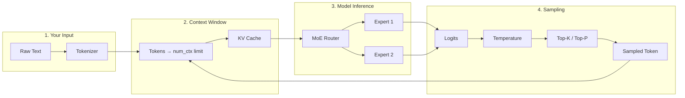
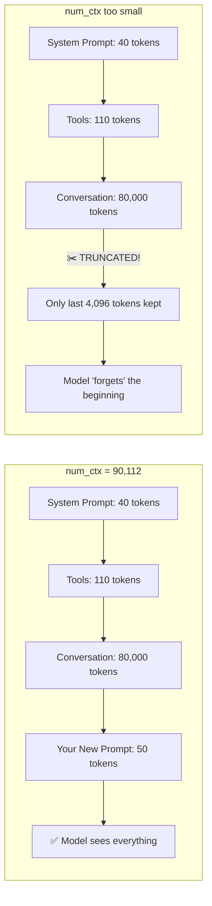
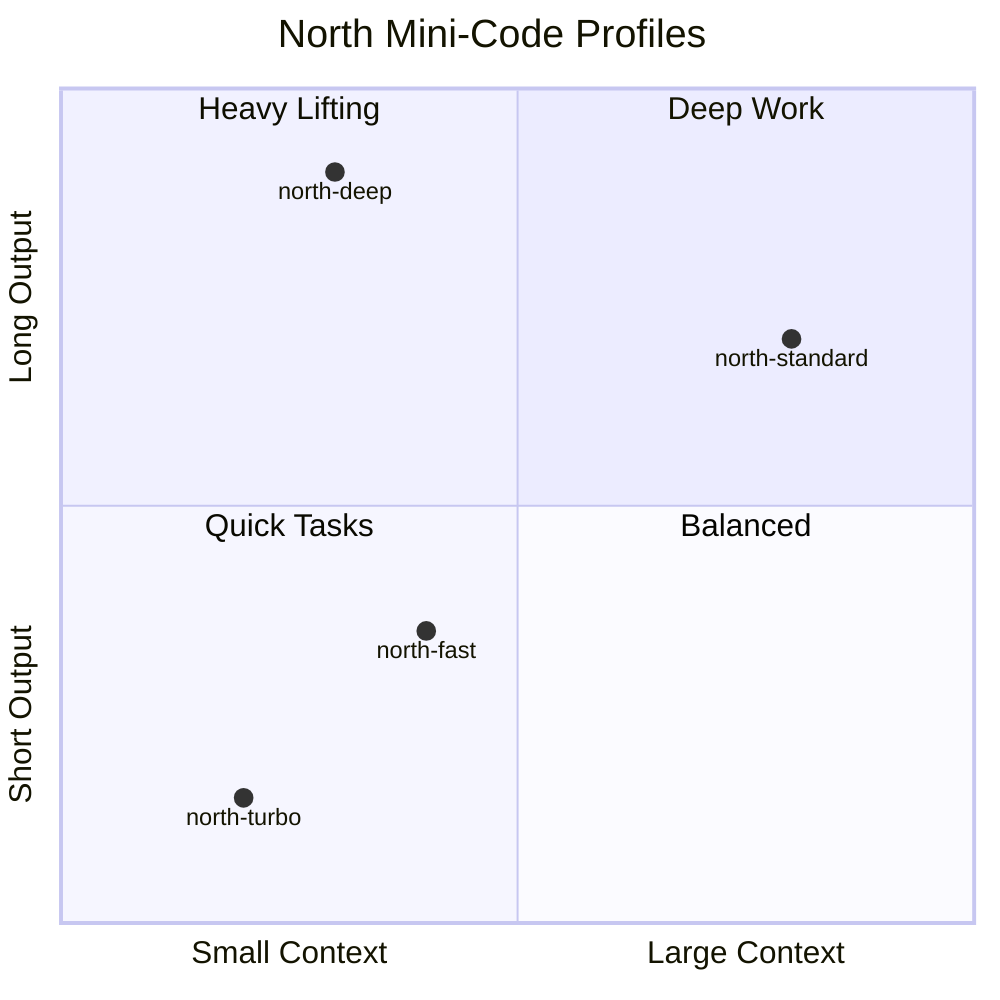

# North Mini-Code: Inside the Engine

> What every parameter actually does, why it matters, and how to tune it like a pro.  
> Based on the FaunDev Local AI Engineering book and Ollama's official docs.

---

## The Pipeline: From Prompt to Token



**Every parameter controls exactly one step in this chain.** Change the wrong one and you'll wonder why the model "forgot" your instructions or started rambling.

---

## 1. The Architecture: Cohere2MoE (Mixture of Experts)

Your North models use a **Cohere2MoE** architecture. Think of it like a team of specialists:

```mermaid
block-beta
    columns 3
    space:1
    block:Router["🧠 Router<br/>(Gating Network)"]:1
    space:1
    block:Expert1["👩‍💻 Code Expert"]:1
    block:Expert2["🔢 Math Expert"]:1
    block:Expert3["📝 Text Expert"]:1
    space:1
    block:Expert4["🌍 General Expert"]:1
    space:1
    block:Output["Combined Output"]:1

    Input["Input: 'Write a Python function'"] --> Router
    Router --> Expert1
    Router --> Expert2
    Router --> Expert4
    Expert1 --> Output
    Expert2 --> Output
    Expert4 --> Output
```

**How it works:** When you ask for code, the router activates the code expert + math expert + general expert. The text expert stays idle. This means:

- **5.7B total parameters** → but only **~2B active** per token
- **Faster** than a dense 5.7B model (sparse activation)
- **Specialization** — each expert gets good at one thing

**The catch:** The full 5.7B must still fit in memory, even though only 2B are used at once. That's why the model is 19 GB.

**Source:** [IBM — Mixture of Experts](https://www.ibm.com/think/topics/mixture-of-experts) | FaunDev Ch. 4

---

## 2. Quantization: Shrinking the Model

```mermaid
block-beta
    columns 5
    block:FP32["FP32<br/>32 bits<br/>22 GB"]:1
    block:FP16["FP16<br/>16 bits<br/>11 GB"]:1
    block:MXFP8["MXFP8<br/>8 bits<br/>31 GB"]:1
    block:NVFP4["NVFP4<br/>4 bits<br/>19 GB"]:1
    block:INT4["INT4<br/>4 bits<br/>~5 GB"]:1

    FP32 -->|"÷2 size"| FP16
    FP16 -->|"÷2 size"| MXFP8
    MXFP8 -->|"÷2 size"| NVFP4
```

**The trick:** Quantization trades precision for memory. A weight stored with 4 bits instead of 32 bits takes 8× less space but is also 8× less precise.

**Your two variants:**

| Format | Bits | Params | Size | Quality | Speed |
|--------|------|--------|------|---------|-------|
| **NVFP4** | 4-bit float | 5.7B | **19 GB** | Good | Fastest |
| **MXFP8** | 8-bit float | 8.7B | **31 GB** | Better | Fast |

**NVFP4** is NVIDIA's 4-bit floating-point format — it keeps more precision than integer 4-bit (INT4) because the floating-point exponent preserves dynamic range. This is why your 5.7B model is 19 GB instead of ~5 GB (which INT4 would be).

**MXFP8** is the OCP Microscaling standard — 8-bit with per-block scaling. It's actually a **larger model** (8.7B vs 5.7B parameters) at higher precision, hence the 31 GB size.

**Source:** FaunDev Ch. 4 ("Quantization: Trade Precision You Don't Need for Memory You Do") | [arXiv: Microscaling Data Formats](https://arxiv.org/abs/2310.10537)

---

## 3. The Context Window (num_ctx)

This is the #1 parameter that bites people. Here's why:

### The Silent Truncation Trap



**The problem:** When your input exceeds `num_ctx`, Ollama **silently truncates the middle**. Your system prompt, tools, or early conversation just vanish. The model has no idea they existed.

```bash
# Check if truncation is happening
journalctl -u ollama --no-pager --pager-end | grep -E "truncating"
```

**Source:** FaunDev Ch. 8 ("Silent Truncation: The Trap")

### Context Memory Math

```mermaid
block-beta
    columns 1
    block:Memory["Total Memory = Model Weights + KV Cache"]:1
    block:KV["KV Cache = num_ctx × bytes_per_token × num_layers × 2"]:1
    block:Example["Example: 90,000 ctx × 2 bytes × 40 layers × 2 = ~14 GB overhead"]:1
```

**Your profiles and their memory cost:**

| Profile | num_ctx | Model Size | KV Cache (est.) | Total RAM |
|---------|---------|------------|-----------------|-----------|
| north-turbo | 32,768 | 19 GB | ~5 GB | ~24 GB |
| north-fast | 49,152 | 19 GB | ~8 GB | ~27 GB |
| **north-standard** | **90,112** | **19 GB** | **~14 GB** | **~33 GB** |
| north-deep | 32,768 | 31 GB | ~5 GB | ~36 GB |

Your M5 Pro has 48 GB unified memory. north-standard uses ~33 GB — leaving 15 GB for macOS and your apps. Comfortable.

**Source:** FaunDev Ch. 4 ("The KV Cache"), Ch. 8 | [Ollama Context Length](https://docs.ollama.com/context-length)

---

## 4. The Sampling Parameters

After the model generates logits (raw scores for every possible next token), the sampling parameters decide which token to actually pick.

### Temperature

```mermaid
block-beta
    columns 3
    block:Logits["Raw Scores<br/>mat: 6.0<br/>floor: 5.0<br/>couch: 4.0<br/>roof: 2.0"]:1
    space:1
    block:Sampling["Temperature →<br/>Softmax ←"]:1
    block:Prob["Probabilities<br/>T=0.2: mat 85%<br/>T=0.2: floor 10%<br/>T=1.0: mat 40%<br/>T=1.0: floor 30%"]:1
```

**Think of it like this:** The model says "mat is the best answer, floor is second best, couch is third." Temperature controls how much you let the model pick #2 or #3 instead of #1.

| Temperature | Behavior | Visual |
|-------------|----------|--------|
| 0.0 | Always picks the top token | 🎯 Dead center |
| **0.2** | **Almost always top, rarely second** | **🎯 Slight wobble** |
| 0.5 | Sometimes picks #2 or #3 | 🎯↔️ Occasional surprises |
| 1.0 | Picks proportionally to probability | 🎲 Random-ish |
| 1.5 | Almost random | 🎲🎲 |

**Your profiles use `temperature: 0.2`** — this is ideal for code. You want deterministic, correct output. For creative writing, bump to 0.7. For poetry, 1.0.

**Source:** FaunDev Ch. 4 ("Temperature"), Ch. 9 | [Ollama Modelfile](https://docs.ollama.com/modelfile)

### Top-K and Top-P (The Filters)

```mermaid
flowchart LR
    subgraph After["After Temperature"]
        A[Token A: 40%]
        B[Token B: 30%]
        C[Token C: 18%]
        D[Token D: 7%]
        E[Token E: 3%]
        F[...98 more...]
    end
    subgraph TopK["Top-K: Keep top 40"]
        A2[Token A: 40%]
        B2[Token B: 30%]
        C2[Token C: 18%]
        D2[Token D: 7%]
        E2[Token E: 3%]
        F2[...35 more...]
    end
    subgraph TopP["Top-P: Keep until ≥ 95%"]
        A3[Token A: 40%]
        B3[Token B: 30%]
        C3[Token C: 18%]
        D3[Token D: 7%]
    end
    subgraph Final["Sample from intersection"]
        G[Token A: 40% ← most likely]
    end

    After --> TopK
    TopK --> TopP
    TopP --> Final
```



**Top-K:** "Only consider the 40 most likely tokens, discard everything else."  
**Top-P:** "Of those, keep adding tokens until their combined probability hits 95%, discard the rest."

They work **together** — top-K first cuts the list, then top-P trims it further.

**Your profiles:** `top_k: 40, top_p: 0.95` — conservative, focused on quality. For more diversity, lower top-K to 20 and top-P to 0.9.

**Source:** FaunDev Ch. 4 | [Ollama Modelfile](https://docs.ollama.com/modelfile)

---

## 5. Output Length (num_predict)

```mermaid
block-beta
    columns 1
    block:Gen["Model generates tokens..."]:1
    block:Check["Count hit num_predict?"]:1
    block:Stop["🛑 Stop generating"]:1

    Gen --> Check
    Check -->|"No"| Gen
    Check -->|"Yes"| Stop
```

**Default is `-1` (unlimited).** Your profiles cap it to prevent runaway generation:

| Profile | num_predict | What you can generate |
|---------|-------------|----------------------|
| north-turbo | 512 | Short reply, one function |
| north-fast | 1,024 | Function + docstring |
| **north-standard** | **2,048** | **Full class, medium file** |
| north-deep | 4,096 | Long file, analysis |

**Watch out:** If the model hits `num_predict` mid-sentence, it just stops. No warning. Always set it higher than you think you need.

---

## 6. KeepAlive and Memory Control

North-standard is a 19 GB model. Loading it takes ~5-10 seconds. **KeepAlive** keeps it loaded in memory between requests.

```mermaid
block-beta
    columns 1
    block:Timeline["KeepAlive = 5m (your config)"]:1
    block:Request1["Request 1 → Model loads → 🚀 Instant response"]:1
    block:Idle["5 minutes of idle time"]:1
    block:Request2["Request 2 → Same model → 🚀 No reload needed"]:1
    block:Unload["After 5 idle minutes → Model unloads → Memory freed"]:1

    Request1 --> Idle
    Idle --> Request2
    Request2 --> Idle
    Idle --> Unload
```

```bash
# Check what's loaded right now
ollama ps

# Your output will look like:
# NAME                     ID       SIZE      PROCESSOR  CONTEXT    UNTIL
# north-standard:latest    abc123   19 GB     100% GPU   90112      4 minutes from now
```

**Source:** FaunDev Ch. 11 ("Keep-Alive and Memory Control")

---

## 7. Profile Comparison



### Side-by-Side Reference

| Parameter | north-turbo | north-fast | **north-standard** | north-deep |
|-----------|-------------|------------|-------------------|------------|
| **Base model** | mlx-nvfp4 | mlx-nvfp4 | **mlx-nvfp4** | mlx-mxfp8 |
| **Parameters** | 5.7B | 5.7B | **5.7B** | 8.7B |
| **Size** | 19 GB | 19 GB | **19 GB** | 31 GB |
| **num_ctx** | 32,768 | 49,152 | **90,112** | 32,768 |
| **num_predict** | 512 | 1,024 | **2,048** | 4,096 |
| **temperature** | 0.2 | 0.2 | **0.2** | 0.2 |
| **top_k** | 40 | 40 | **40** | — |
| **top_p** | 0.95 | 0.95 | **0.95** | 0.95 |
| **Est. RAM** | ~24 GB | ~27 GB | **~33 GB** | ~36 GB |
| **Best for** | Quick chat, autocomplete | Small functions, docs | **Full code, complex tasks** | Heavy reasoning |

---

## 8. Quick Reference: When to Change What

### Your goal → Which parameter to tune

| Goal | Parameter | Direction |
|------|-----------|-----------|
| More deterministic code | `temperature` | Lower → 0.1 |
| More creative output | `temperature` | Raise → 0.7 |
| Model keeps forgetting instructions | `num_ctx` | Raise → 131072 |
| Response cuts off mid-sentence | `num_predict` | Raise → 4096 |
| Model repeats itself | `repeat_penalty` | Raise → 1.2 |
| Too much RAM usage | `num_ctx` | Lower → 32768 |
| Model too slow | `num_ctx` | Lower → 32768 |
| Want same output every time | `seed` | Set to fixed number (e.g., 42) |

### Testing parameters at runtime

```bash
# Via the Ollama API (no need to rebuild Modelfile)
curl -s http://localhost:11434/api/chat -d '{
  "model": "north-standard:latest",
  "messages": [{"role": "user", "content": "Write a Python function"}],
  "options": {
    "temperature": 0.1,
    "num_ctx": 131072,
    "num_predict": 4096
  }
}'
```

**Source:** FaunDev Ch. 9 ("Using the API to Control the Model")

---

## References

| Source | Link |
|--------|------|
| FaunDev — Local AI Engineering with Ollama | `/Users/vrock/Documents/Books/AI/faundev/...` |
| Ollama Modelfile Reference | [docs.ollama.com/modelfile](https://docs.ollama.com/modelfile) |
| Ollama Context Length | [docs.ollama.com/context-length](https://docs.ollama.com/context-length) |
| IBM — Mixture of Experts | [ibm.com/think/topics/mixture-of-experts](https://www.ibm.com/think/topics/mixture-of-experts) |
| Microscaling Data Formats (MX) | [arxiv.org/abs/2310.10537](https://arxiv.org/abs/2310.10537) |
| Ollama API Reference | [docs.ollama.com/api](https://docs.ollama.com/api) |