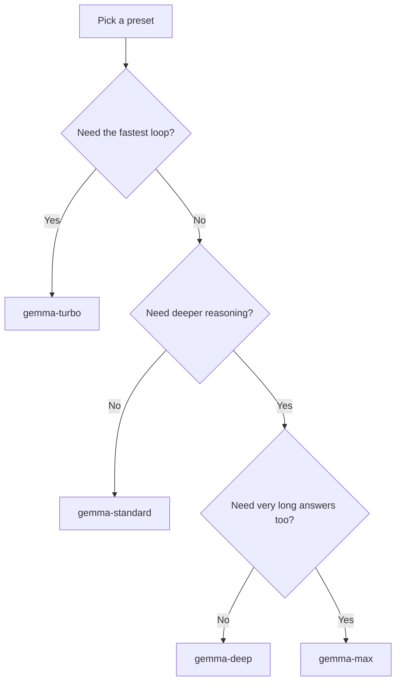

# 🙂 Kronk Profiles Guide

This repo uses **Kronk profiles** for saved model directories and a separate **Gemma tuning ladder** for day-to-day speed vs depth tuning.

## 🧠 Two layers to remember

- `~/.kronk` = the active saved profile
- `~/.kronk-<name>` = saved model profiles
- `scripts/kronk_switch.sh` = switches saved profiles
- `scripts/kronk_tuning_switch.sh` = switches the active tuning preset
- `scripts/apply_llm_profile.sh` = switches a preset and restarts Kronk

---

## ⚡ Speed up your workflow first

Before changing presets, try these:

1. keep the prompt focused on one task
2. attach fewer files
3. ask for a shorter answer first
4. let OpenCode compact when the task drifts

If that is not enough, then switch presets.

---

## 🎛️ Preferred Gemma presets

### 🏷️ Preset naming convention

The preset ladder is split into **two groups**:

- **speed presets** for faster loops and shorter answers
- **depth presets** for heavier reasoning and longer answers

Naming rule:

- **speed**: `gemma-<speed-label>`
- **depth**: `gemma-<depth-label>`

### ⚡ Speed presets

| Preset | Context | Thinking | `max_tokens` | Best for |
|---|---:|---|---:|---|
| `gemma-turbo` | 32K | off | 512 | fastest loop |
| `gemma-fast` | 32K | off | 1024 | quick coding help |
| `gemma-standard` | 64K | off | 2048 | default daily work |

### 🧠 Depth presets

| Preset | Context | Thinking | `max_tokens` | Best for |
|---|---:|---|---:|---|
| `gemma-deep` | 64K | on | 2048 | deeper debugging / planning |
| `gemma-max` | 64K | on | 4096 | longest deep answers |

All of these share the same Gemma runtime shape:

- **32K for `gemma-turbo` / `gemma-fast`**
- **64K for `gemma-standard` / `gemma-deep` / `gemma-max`**
- **`nseq-max: 2`**

---

## 🚀 Start Kronk

From the repo root:

`bash scripts/start.sh`

What it does:

- runs preflight checks
- verifies the active profile already has the chosen model
- starts Kronk
- warms the active model

To update Kronk explicitly:

`bash scripts/update.sh`

---

## 🛑 Stop Kronk

`bash scripts/stop.sh`

## 🔁 Restart Kronk

`bash scripts/restart.sh`

Restart only Kronk:

`bash scripts/restart.sh kronk`

---

## 🔀 Switch saved model profiles

Run:

`bash scripts/kronk_switch.sh`

The switcher shows:

- the active profile in `~/.kronk`
- the saved profiles found under `~/.kronk-*`
- options to switch, save, or create a new empty profile

---

## 🎚️ Switch tuning presets

Interactive:

`bash scripts/kronk_tuning_switch.sh`

Direct:

`bash scripts/kronk_tuning_switch.sh gemma-standard`

One-step apply + restart:

`bash scripts/apply_llm_profile.sh gemma-standard`

That flow also syncs OpenCode's global default model to the same preset alias.

## 🔗 OpenCode Integration

OpenCode uses the preset aliases defined in the global config file:

- **live config**: `~/.config/opencode/opencode.jsonc`
- **repo copy**: `opencode/opencode.jsonc`

When you apply a preset with:

`bash scripts/apply_llm_profile.sh gemma-standard`

the workflow does three things:

1. switches the active Kronk preset
2. restarts Kronk
3. updates OpenCode's default model through `scripts/sync_opencode_model.sh`

Use `opencode/opencode.jsonc` as the tracked reference copy for the repo. The live OpenCode file in your home directory remains the active runtime file.

### 🔗 OpenCode ↔ Kronk alignment

OpenCode declares `limit.context` and `limit.output` per preset in `opencode.jsonc`. These values control how much context OpenCode allows before triggering compaction and how many output tokens it reserves. **They must match the corresponding Kronk preset values** — a mismatch causes either context overflow (OpenCode fills more than Kronk can handle) or unnecessary early compaction.

| Preset | opencode `limit.context` | Kronk `context-window` | opencode `limit.output` | Kronk `max_tokens` |
|---|---:|---:|---:|---:|
| `gemma-turbo` | 32768 | 32768 | 512 | 512 |
| `gemma-fast` | 32768 | 32768 | 1024 | 1024 |
| `gemma-standard` | 65536 | 65536 | 2048 | 2048 |
| `gemma-deep` | 65536 | 65536 | 2048 | 2048 |
| `gemma-max` | 65536 | 65536 | 4096 | 4096 |

> Whenever you add or change a preset, update both `opencode/opencode.jsonc` and the matching file under `kronk/presets/` to keep them in sync.

---

## 🧭 Which preset should I use?

Quick rule:

- use **`gemma-standard`** by default
- drop to **`gemma-fast`** or **`gemma-turbo`** when the loop feels slow
- move up to **`gemma-deep`** or **`gemma-max`** only when quality or answer length is the missing piece

---

## 💾 Save the current profile

If your active `~/.kronk` already has a model loaded, the switcher can save it as:

`~/.kronk-<model-name>`

That makes it easy to come back to the same setup later.

---

## 🆕 Create a new empty profile

Choose `n` in the switcher.

After that:

1. pull a model into the active `~/.kronk` with `kronk model pull <MODEL_ID> --local`
2. make sure `.env` has the matching `KRONK_MODELS=...`
3. start Kronk with `bash scripts/start.sh`

---

## ✅ Typical daily flow

1. choose the saved model profile you want: `bash scripts/kronk_switch.sh`
2. apply the daily preset you want: `bash scripts/apply_llm_profile.sh gemma-standard`
3. work normally
4. stop Kronk when done: `bash scripts/stop.sh`

---

## 🪵 Logs

After starting Kronk, logs are written under `logs/`.

To follow the newest log:

`tail -f logs/kronk_*.log`
