# Qwen3.6 27B Coding: Inside the Engine

> What every parameter actually does, why it matters, and how to tune it like a pro.  
> Based on the "Local AI Engineering with Ollama" book and Ollama's official docs.

---

## The Pipeline: From Prompt to Token

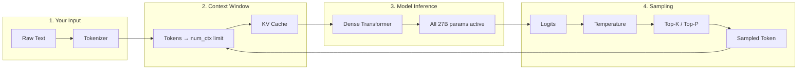

**Every parameter controls exactly one step in this chain.** Change the wrong one and you'll wonder why the model "forgot" your instructions or started rambling.

---

## 1. The Architecture: Dense Transformer

Your Qwen3.6 models use a **Dense Transformer** architecture — every parameter is active for every single token. This is fundamentally different from MoE (Mixture of Experts) models:

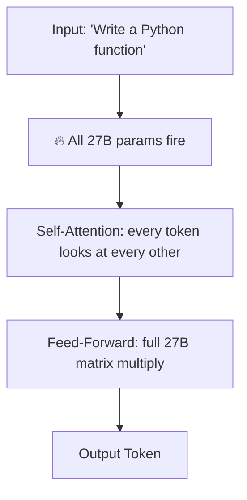

**How it works:** Unlike MoE where only some experts activate per token, a dense model uses **every parameter** for every token. This means:

- **27B total parameters** → **27B active per token** (vs 5.7B / ~2B active for MoE)
- **More compute per token** — slower tokens/second but better reasoning depth
- **No routing overhead** — simpler architecture, less code complexity
- **Full attention** — every parameter contributes to understanding

**The tradeoff:** The full 27B must fit in memory and every token uses all of it. At 4-bit quantization (nvfp4), that's 19 GB — same as north-standard, but slower because more compute per token.

**Source:** [Qwen Official — Qwen3.6 Technical Report](https://qwenlm.github.io/blog/) | Local AI Engineering with Ollama Ch. 4

---

## 1.5 MLX: Why Apple Silicon Makes a Difference

Your Qwen3.6 models come in `mlx-nvfp4` variants. The **MLX** prefix is Apple's machine learning framework, built specifically for Apple Silicon. Understanding why matters.

### The Unified Memory Advantage

On a typical PC, the CPU and GPU have separate memory pools. Data must be copied back and forth — slow and inefficient. Apple Silicon uses **unified memory**: CPU, GPU, and Neural Engine share the same pool.

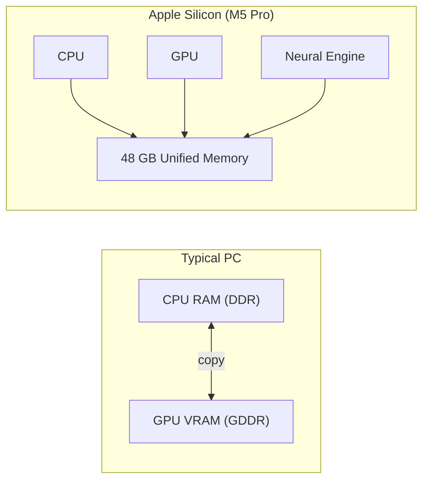

**What this means for you:** MLX does not copy data between CPU and GPU — it just points to the same memory. Your M5 Pro's 48 GB is one pool accessible by everything. Whisper (speech) and Ollama (LLM) can run on different compute units simultaneously without contention.

### MLX Whisper Performance

The MEAP book benchmarks show why MLX matters for speech — and the same principles apply to your MLX-quantized models:

| Task | Standard Approach | MLX | Speedup |
|------|------------------|-----|---------|
| Whisper tiny (60s clip) | 8 s (CPU) | 2 s | ~4× |
| Whisper small (60s clip) | 28 s (CPU) | 6 s | ~5× |
| Whisper medium (60s clip) | 75 s (CPU) | 14 s | ~5× |
| Whisper large-v3 (60s clip) | 210 s (CPU) | 38 s | ~6× |

The same principle applies to your Qwen3.6 models: MLX-quantized formats (nvfp4) let the model run on GPU directly without conversion, keeping inference fast and efficient.

**Source:** *Build Applications with Local AI Models on a Mac* Ch. 9 (MLX Whisper)

---

## 2. Quantization: Shrinking the Model

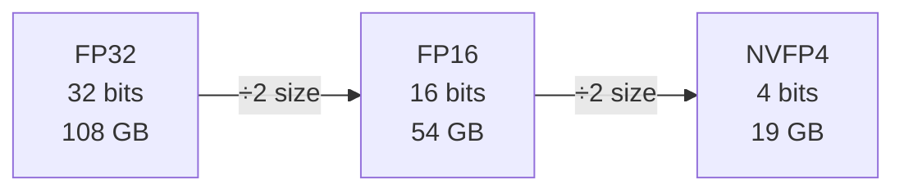

**The trick:** Quantization trades precision for memory. A weight stored with 4 bits instead of 32 bits takes 8× less space but is also 8× less precise.

**Your variant:**

| Format | Bits | Params | Size | Quality |
|--------|------|--------|------|---------|
| **NVFP4** | 4-bit float | 27B | **19 GB** | Good |

**NVFP4** is NVIDIA's 4-bit floating-point format — it keeps more precision than integer 4-bit (INT4) because the floating-point exponent preserves dynamic range. This is why a 27B model fits in 19 GB instead of ~13 GB (which INT4 would be).

**Source:** Local AI Engineering with Ollama Ch. 4 ("Quantization: Trade Precision You Don't Need for Memory You Do") | [arXiv: Microscaling Data Formats](https://arxiv.org/abs/2310.10537)

---

## 3. The Context Window (num_ctx)

This is the #1 parameter that bites people. Here's why:

### The Silent Truncation Trap

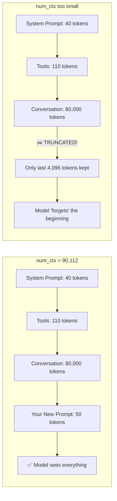

**The problem:** When your input exceeds `num_ctx`, Ollama **silently truncates the middle**. Your system prompt, tools, or early conversation just vanish. The model has no idea they existed.

```bash
# Check if truncation is happening
journalctl -u ollama --no-pager --pager-end | grep -E "truncating"
```

**Source:** Local AI Engineering with Ollama Ch. 8 ("Silent Truncation: The Trap")

### Context Memory Math

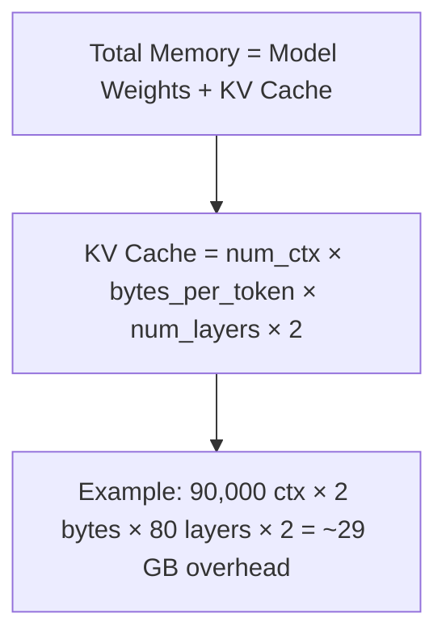

**Your profiles and their memory cost:**

| Profile | num_ctx | Model Size | KV Cache (est.) | Total RAM |
|---------|---------|------------|-----------------|-----------|
| qwen36-turbo | 32,768 | 19 GB | ~10 GB | ~29 GB |
| qwen36-fast | 65,536 | 19 GB | ~21 GB | ~40 GB |
| **qwen36-standard** | **90,112** | **19 GB** | **~29 GB** | **~48 GB** |
| qwen36-deep | 65,536 | 19 GB | ~21 GB | ~40 GB |

Your M5 Pro has 48 GB unified memory. qwen36-standard uses ~48 GB — tight but fits. qwen36-fast and qwen36-deep are more comfortable at ~40 GB.

**Note:** Qwen3.6 has roughly 2× the layers of north-mini-code (80 vs 40), so the KV cache is roughly 2× larger for the same context length.

**Source:** Local AI Engineering with Ollama Ch. 4 ("The KV Cache"), Ch. 8 | [Ollama Context Length](https://docs.ollama.com/context-length)

---

## 4. The Sampling Parameters

After the model generates logits (raw scores for every possible next token), the sampling parameters decide which token to actually pick.

### Temperature

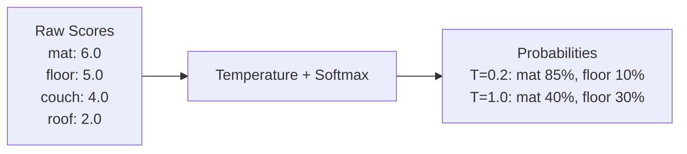

**Think of it like this:** The model says "mat is the best answer, floor is second best, couch is third." Temperature controls how much you let the model pick #2 or #3 instead of #1.

| Temperature | Behavior | Visual |
|-------------|----------|--------|
| 0.0 | Always picks the top token | 🎯 Dead center |
| **0.2** | **Almost always top, rarely second** | **🎯 Slight wobble** |
| 0.5 | Sometimes picks #2 or #3 | 🎯↔️ Occasional surprises |
| 1.0 | Picks proportionally to probability | 🎲 Random-ish |
| 1.5 | Almost random | 🎲🎲 |

**Your profiles use `temperature: 0.2`** — this is ideal for code. You want deterministic, correct output. For creative writing, bump to 0.7. For poetry, 1.0.

**Source:** Local AI Engineering with Ollama Ch. 4 ("Temperature"), Ch. 9 | [Ollama Modelfile](https://docs.ollama.com/modelfile)

### Top-K and Top-P (The Filters)

```mermaid
flowchart LR
    subgraph After["After Temperature"]
        A[Token A: 40%]
        B[Token B: 30%]
        C[Token C: 18%]
        D[Token D: 7%]
        E[Token E: 3%]
        F[...98 more...]
    end
    subgraph TopK["Top-K: Keep top 40"]
        A2[Token A: 40%]
        B2[Token B: 30%]
        C2[Token C: 18%]
        D2[Token D: 7%]
        E2[Token E: 3%]
        F2[...35 more...]
    end
    subgraph TopP["Top-P: Keep until ≥ 95%"]
        A3[Token A: 40%]
        B3[Token B: 30%]
        C3[Token C: 18%]
        D3[Token D: 7%]
    end
    subgraph Final["Sample from intersection"]
        G[Token A: 40% ← most likely]
    end

    After --> TopK
    TopK --> TopP
    TopP --> Final
```

**Top-K:** "Only consider the 40 most likely tokens, discard everything else."  
**Top-P:** "Of those, keep adding tokens until their combined probability hits 95%, discard the rest."

They work **together** — top-K first cuts the list, then top-P trims it further.

**Your profiles:** `top_k: 40, top_p: 0.95` — conservative, focused on quality. For more diversity, lower top-K to 20 and top-P to 0.9.

**Source:** Local AI Engineering with Ollama Ch. 4 | [Ollama Modelfile](https://docs.ollama.com/modelfile)

---

## 5. Output Length (num_predict)

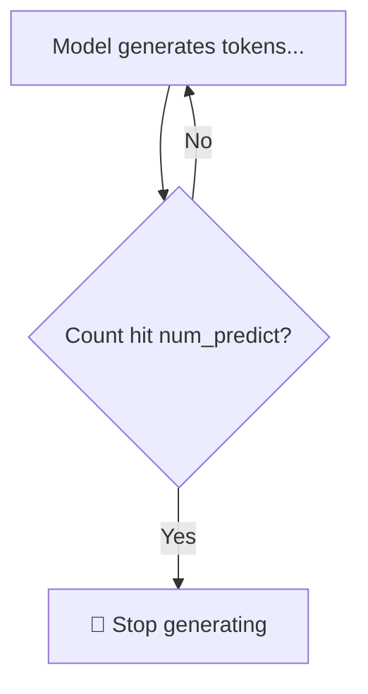

**Default is `-1` (unlimited).** Your profiles cap it to prevent runaway generation:

| Profile | num_predict | What you can generate |
|---------|-------------|----------------------|
| qwen36-turbo | 512 | Short reply, one function |
| qwen36-fast | 1,024 | Function + docstring |
| **qwen36-standard** | **2,048** | **Full class, medium file** |
| qwen36-deep | 4,096 | Long file, analysis |

**Watch out:** If the model hits `num_predict` mid-sentence, it just stops. No warning. Always set it higher than you think you need.

---

## 6. KeepAlive and Memory Control

Qwen36-standard is a 19 GB model. Loading it takes ~5-10 seconds. **KeepAlive** keeps it loaded in GPU memory between requests — controlled by the `OLLAMA_KEEP_ALIVE` env var in `ollama/ollama.env`.

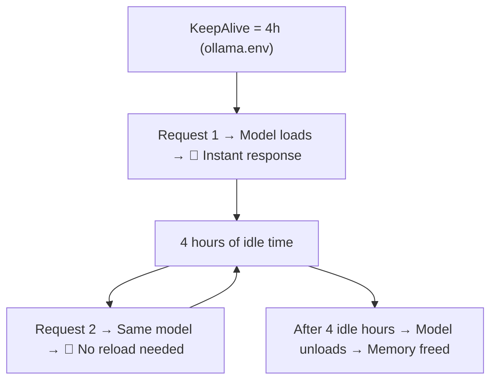

```bash
# Check what's loaded right now
ollama ps

# Your output will look like:
# NAME                     ID       SIZE      PROCESSOR  CONTEXT    UNTIL
# qwen36-standard:latest   abc123   19 GB     100% GPU   90112      3 hours from now
```

**Config location:** `ollama/ollama.env` → `OLLAMA_KEEP_ALIVE=4h`.

**Source:** Local AI Engineering with Ollama Ch. 11 ("Keep-Alive and Memory Control")

---

## 7. Profile Comparison

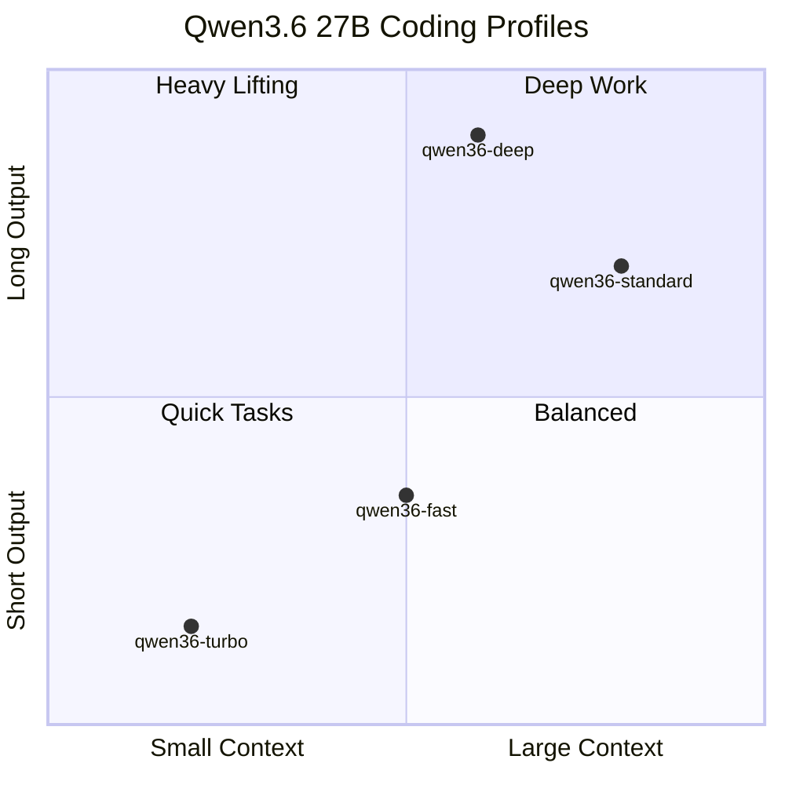

### Side-by-Side Reference

| Parameter | qwen36-turbo | qwen36-fast | **qwen36-standard** | qwen36-deep |
|-----------|-------------|-------------|--------------------|------------|
| **Base model** | nvfp4 | nvfp4 | **nvfp4** | nvfp4 |
| **Parameters** | 27B | 27B | **27B** | 27B |
| **Size** | 19 GB | 19 GB | **19 GB** | 19 GB |
| **num_ctx** | 32,768 | 65,536 | **90,112** | 65,536 |
| **num_predict** | 512 | 1,024 | **2,048** | 4,096 |
| **temperature** | 0.2 | 0.2 | **0.2** | 0.2 |
| **top_k** | 40 | 40 | **40** | 40 |
| **top_p** | 0.95 | 0.95 | **0.95** | 0.95 |
| **Est. RAM** | ~29 GB | ~40 GB | **~48 GB** | ~40 GB |
| **Best for** | Quick chat, autocomplete | Small functions, docs | **Full code, complex tasks** | Heavy reasoning, analysis |

---

## 8. Quick Reference: When to Change What

### Your goal → Which parameter to tune

| Goal | Parameter | Direction |
|------|-----------|-----------|
| More deterministic code | `temperature` | Lower → 0.1 |
| More creative output | `temperature` | Raise → 0.7 |
| Model keeps forgetting instructions | `num_ctx` | Raise → 131072 |
| Response cuts off mid-sentence | `num_predict` | Raise → 4096 |
| Model repeats itself | `repeat_penalty` | Raise → 1.2 |
| Too much RAM usage | `num_ctx` | Lower → 32768 |
| Model too slow | `num_ctx` | Lower → 32768 |
| Want same output every time | `seed` | Set to fixed number (e.g., 42) |

### Testing parameters at runtime

```bash
# Via the Ollama API (no need to rebuild Modelfile)
curl -s http://localhost:11434/api/chat -d '{
  "model": "qwen36-standard:latest",
  "messages": [{"role": "user", "content": "Write a Python function"}],
  "options": {
    "temperature": 0.1,
    "num_ctx": 131072,
    "num_predict": 4096
  }
}'
```

**Source:** Local AI Engineering with Ollama Ch. 9 ("Using the API to Control the Model")

---

## References

| Source | Link |
|--------|------|
| Ollama Modelfile Reference | [docs.ollama.com/modelfile](https://docs.ollama.com/modelfile) |
| Ollama Context Length | [docs.ollama.com/context-length](https://docs.ollama.com/context-length) |
| Qwen Official Blog | [qwenlm.github.io/blog](https://qwenlm.github.io/blog/) |
| Microscaling Data Formats (MX) | [arxiv.org/abs/2310.10537](https://arxiv.org/abs/2310.10537) |
| Ollama API Reference | [docs.ollama.com/api](https://docs.ollama.com/api) |